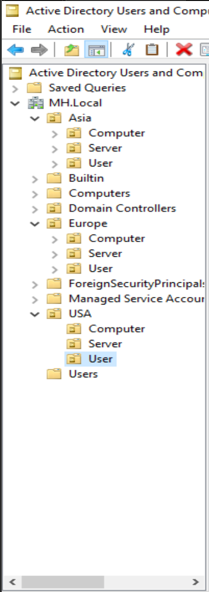
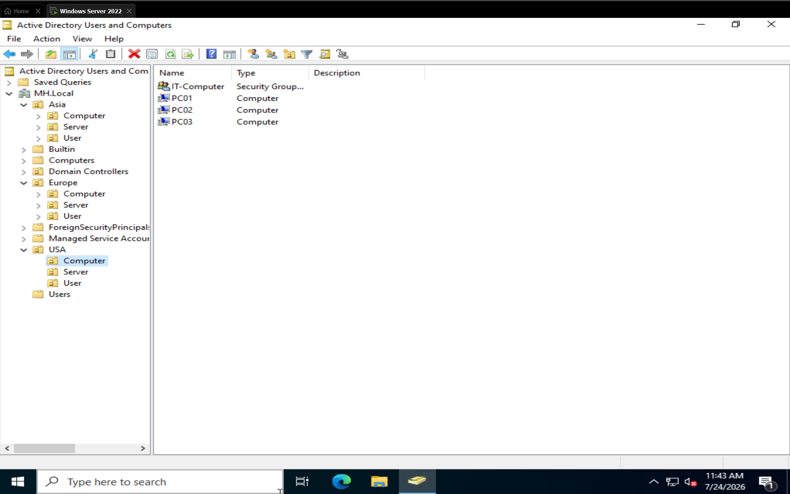
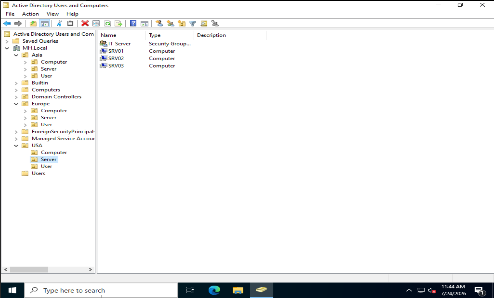
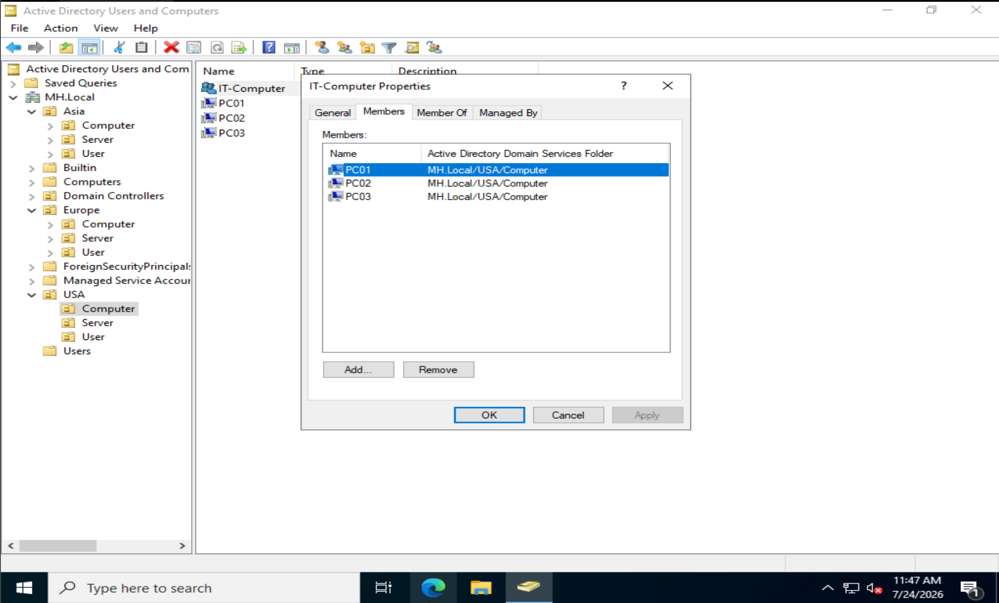

# Windows Server Active Directory Home Lab

## Project Overview
Built a simulated enterprise IT environment using VMware Workstation Pro 
and Windows Server 2022. Configured Active Directory from scratch, including 
domain controller setup, organizational unit design, and user and group 
management across geographic and departmental structures.

## Tools Used
- VMware Workstation Pro
- Windows Server 2022 Evaluation
- Active Directory Domain Services (AD DS)

---

## Active Directory Setup & Organizational Structure

Set up a domain controller from scratch on Windows Server 2022 and built 
an organizational unit structure that mirrors how real enterprise environments 
organize their Active Directory.

### Screenshot 1 — OU Tree Structure

The full organizational unit hierarchy built under the MH.Local domain. 
Geographic OUs (USA, Europe, Asia) each contain three sub-OUs — 
Computer, Server, and User — to separate different object types by department.

### Screenshot 2 — User OU: Groups and User Accounts

Inside the USA User OU, showing the IT-Users security group, DL-ITAdmins 
distribution group, and three user accounts. Security groups are used for 
assigning permissions, while distribution groups are used for email lists.

### Screenshot 3 — Computer OU: Security Group and Placeholder PCs

Inside the USA Computer OU showing the IT-Computer security group alongside 
placeholder computer objects PC01, PC02, and PC03 representing workstations 
assigned to the IT department.

### Screenshot 4 — Server OU: Security Group and Placeholder Servers

Inside the USA Server OU showing the IT-Server security group alongside 
placeholder server objects SRV01, SRV02, and SRV03 representing servers 
assigned to the IT department.

### Screenshot 5 — IT-Computer Group Members Tab

IT-Computer group properties showing PC01, PC02, and PC03 confirmed as 
members of the security group. This proves the computer objects are not 
just sitting in the OU but are actively assigned to the correct group.

### What I Learned
Group names in Active Directory must be unique across the entire domain, 
not just within an OU. When creating matching IT groups across the User, 
Computer, and Server OUs, using a naming convention like IT-Users, 
IT-Computer, and IT-Server avoided conflicts and made the structure 
immediately readable. Security groups handle permissions and access while 
distribution groups handle email lists — understanding that distinction 
was key to setting up the right group type for each purpose.

---

## Upcoming
- Group Policy Management
- GPO Testing and Computer Domain Join
- File Services and Network Sharing
