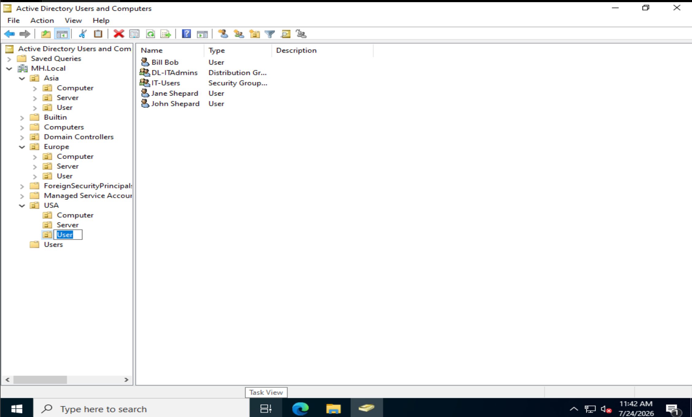
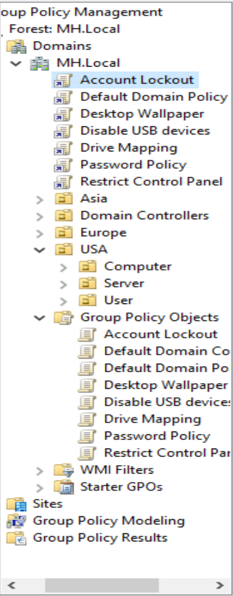
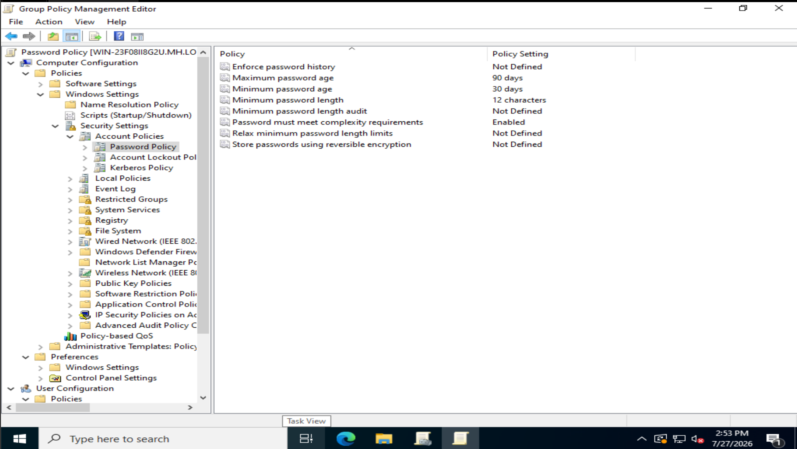
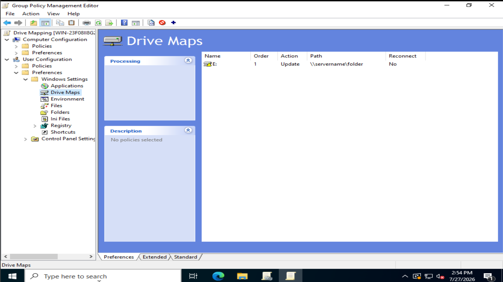
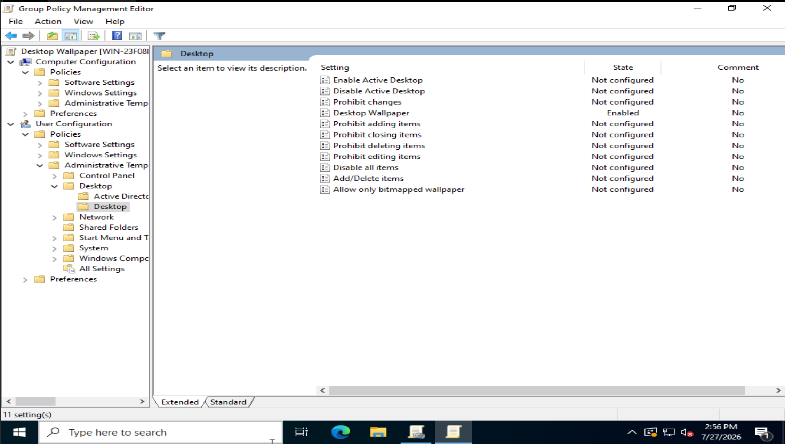
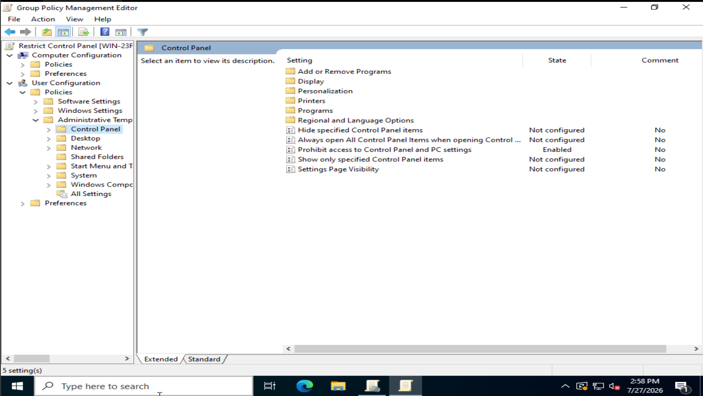
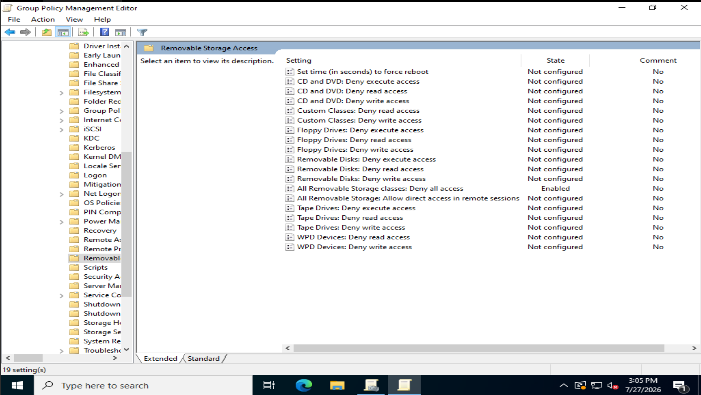
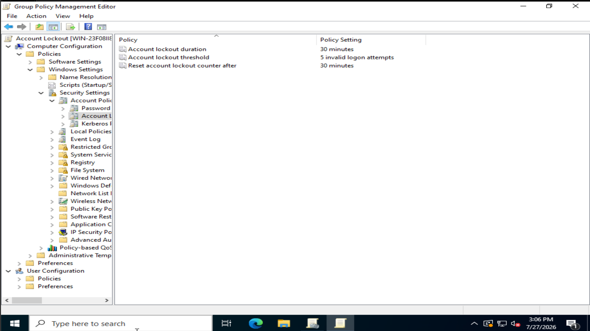

# Windows Server Active Directory Home Lab

## Project Overview
Built a simulated enterprise IT environment using VMware Workstation Pro 
and Windows Server 2022. Configured Active Directory from scratch, including 
domain controller setup, organizational unit design, and user and group 
management across geographic and departmental structures.

## Tools Used
- VMware Workstation Pro
- Windows Server 2022 Evaluation
- Active Directory Domain Services (AD DS)

---

## Active Directory Setup & Organizational Structure

Set up a domain controller from scratch on Windows Server 2022 and built 
an organizational unit structure that mirrors how real enterprise environments 
organize their Active Directory.

### Screenshot 1 — OU Tree Structure

The full organizational unit hierarchy built under the MH.Local domain. 
Geographic OUs (USA, Europe, Asia) each contain three sub-OUs — 
Computer, Server, and User — to separate different object types by department.

### Screenshot 2 — User OU: Groups and User Accounts

Inside the USA User OU, showing the IT-Users security group, DL-ITAdmins 
distribution group, and three user accounts. Security groups are used for 
assigning permissions, while distribution groups are used for email lists.

### Screenshot 3 — Computer OU: Security Group and Placeholder PCs

Inside the USA Computer OU showing the IT-Computer security group alongside 
placeholder computer objects PC01, PC02, and PC03 representing workstations 
assigned to the IT department.

### Screenshot 4 — Server OU: Security Group and Placeholder Servers

Inside the USA Server OU showing the IT-Server security group alongside 
placeholder server objects SRV01, SRV02, and SRV03 representing servers 
assigned to the IT department.

### Screenshot 5 — IT-Computer Group Members Tab

IT-Computer group properties showing PC01, PC02, and PC03 confirmed as 
members of the security group. This proves the computer objects are not 
just sitting in the OU but are actively assigned to the correct group.

### What I Learned
Group names in Active Directory must be unique across the entire domain, 
not just within an OU. When creating matching IT groups across the User, 
Computer, and Server OUs, using a naming convention like IT-Users, 
IT-Computer, and IT-Server avoided conflicts and made the structure 
immediately readable. Security groups handle permissions and access while 
distribution groups handle email lists — understanding that distinction 
was key to setting up the right group type for each purpose.

---

## Group Policy Management

Created and configured six Group Policy Objects (GPOs) in the Group Policy Management Console (GPMC) to enforce security settings and manage user environments across the domain.

### Screenshot 1 — GPMC Overview

All six GPOs listed under the MH.Local domain in the Group Policy Management Console, including the bonus Account Lockout policy.

### Screenshot 2 — Password Policy Settings

Password policy configured with a 12-character minimum length, complexity requirements enabled, a 90-day maximum password age, and a 30-day minimum age. Applied under Computer Configuration since the computer enforces login requirements.

### Screenshot 3 — Drive Mapping Configuration

Network drive mapped to E: pointing to \\servername\folder. Configured under User Configuration Preferences since users can modify mapped drives if needed.

### Screenshot 4 — Desktop Wallpaper Policy

Desktop wallpaper policy enabled under User Configuration Policies to enforce a consistent wallpaper across all users. Set as a Policy rather than a Preference so users cannot change it.

### Screenshot 5 — Restrict Control Panel

Control panel access fully prohibited for all users. Configured under User Configuration Policies with Prohibit access to Control Panel and PC settings set to Enabled.

### Screenshot 6 — Disable USB Storage

All removable storage classes are denied access at the computer level. Configured under Computer Configuration Policies to prevent users from using any USB storage devices.

### Screenshot 7 — Account Lockout Policy (Bonus)

Account lockout configured with a threshold of 5 invalid logon attempts, a 30-minute lockout duration, and a 30-minute reset counter. This prevents brute force attacks on user accounts.

### What I Learned
Group Policy has two configuration types — Computer Configuration applies
settings to the machine regardless of who logs in, while User Configuration
applies settings to the user wherever they log in. Policies are enforced
and cannot be changed by users, while Preferences set defaults that users
can modify. Choosing the right combination of configuration type and setting
type is the key decision when creating any GPO in a real enterprise environment.

---

## Upcoming
- GPO Testing and Computer Domain Join
- File Services and Network Sharing
